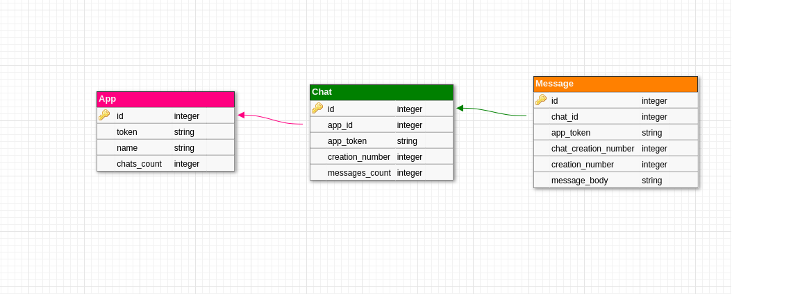

<h2> Instabug Back-end Challenge </h2>

# Contents
 - [About](#about) 
 - [Database Schema](#database-schema) 
 - [Pre Installations](#pre-installations)
 - [Project Cloning](#project-cloning)
 - [Running The Project](#running-the-project)
 - [Redis Dashboard](#redis-dashboard)
 - [Requests File](#requests-file)

## About

- This is a Challenge about a project where users can create applications with tokens where they can use that token for generating chats and inside those chats they can generate messages too.

- each chat and message has a creation number, app token is used along with the chat creation number to show a chat, and app token is used along with the chat number and message number to show that message.

- Users can access those applications chat, messages, using the token provided by the system upon creation of the app.

- They can also update applications names and messages bodies.

- there's also a search feature for specific text in all messages of a specific chat. 

## Database Schema

## Pre Installations

- [Docker](https://www.digitalocean.com/community/tutorials/how-to-install-and-use-docker-on-ubuntu-20-04)
- [Docker Compose](https://linuxhostsupport.com/blog/how-to-install-and-configure-docker-compose-on-ubuntu-20-04/)
- [Docker Desktop](https://docs.docker.com/desktop/install/ubuntu/)

## Project Cloning

- [Clone Any Project From Github](https://www.theserverside.com/blog/Coffee-Talk-Java-News-Stories-and-Opinions/How-to-git-clone-on-Ubuntu-with-GitLab-and-GitHub)

## Running the Project

to run the project you need to do the following 

`docker-compose up`

to debug the project using byebug while the docker is app use

`docker attach instabug_app_1`

to access the rails console too, use 

`docker-compose run app rails console`

## Redis Dashboard

- [Access Redis Dashboard](http://localhost:3001/sidekiq/)

## Requests File

- [Download Requests File](https://drive.google.com/file/d/1ztoXd8bNxIZEt2Sg299VsjgiaPE2FMio/view?usp=sharing) and import it to Postman.